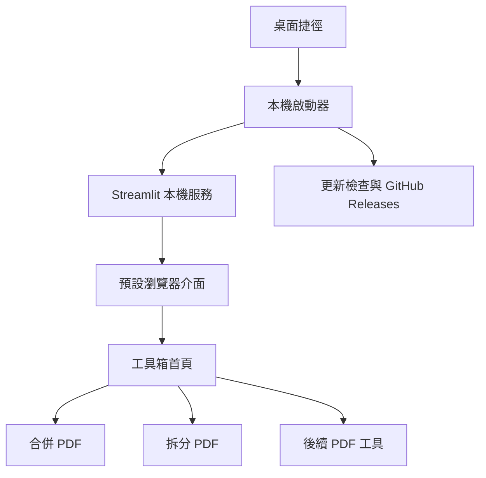

# 本機 PDF 工具箱實作計畫

> 更新日期：2026-07-17
>
> 目前目標：完成可交付且可在無 Python 電腦離線安裝的 `0.1.0`。

## 目前狀態

| 項目 | 狀態 | 說明 |
| --- | --- | --- |
| uv 與 Python 3.13 專案 | 已完成 | `uv.lock` 已建立 |
| PDF 合併核心 | 已完成 | 記憶體內驗證與合併 |
| Streamlit 合併介面 | 已完成 | 可排序、移除、命名及下載 |
| 合併介面預覽與單一狀態 | 程式已完成、安裝版 GUI 待驗收 | 單一 `pdf_items`、逐份第一頁縮圖、純拖曳響應式多欄卡片、跨列排序、區內捲動及 50 份／500 MB 限制均已實作 |
| 自動化測試 | 已完成 | 51 項合併核心、預覽資源釋放、容量邊界、拖曳事件完整性、離線前端資源、完整合併互動、介面、啟動器每日／手動更新檢查與打包設定測試通過；封裝清單與所有自家 Python 模組一致 |
| 瀏覽器介面驗證 | 本機通過、安裝版待驗收 | 已以六份不同方向 PDF 實際跨列拖曳、移除、合併及下載；預設寬度四欄、640 像素寬度兩欄與卡片區內捲動均已確認 |
| PDF 渲染驗證 | 已完成 | 直向、橫向、旋轉頁面、合併交界與 PDFium 第一頁縮圖均已渲染檢查，方向與內容正確 |
| Git 與 GitHub repository | 已完成 | `main` 已推送至公開的 `Yufe1210/local-pdf-toolbox`，`origin` 與 HTTPS 更新資訊均已驗證 |
| 工具箱模組化 | 已完成 | 首頁、共用驗證、合併功能與介面已拆分 |
| 桌面啟動器 | 進行中 | 已完成單一執行個體、動態連接埠、自動開啟瀏覽器、結束控制、瀏覽器關閉狀態與 GitHub 手動更新入口；待安裝版 GUI 驗收 |
| PyInstaller onedir | 進行中 | Python 3.13.14 建置成功並核對 15 個必要模組、自訂拖曳網格前端、PDFium DLL 及授權檔；最新完整建置直接通過 `--self-test` 與 loopback smoke test，待乾淨環境 GUI 驗收 |
| Inno Setup 安裝程式 | 進行中 | 含響應式拖曳網格的未簽章安裝候選檔已成功編譯，採 per-user 離線安裝、捷徑及解除安裝；待乾淨環境驗收 |
| 發布驗收腳本 | 程式已完成、待執行 | 已加入安裝後未自動啟動、安裝版 `--self-test`、PDFium／授權檔、實際桌面捷徑啟動及互動 GUI／關閉頁面確認點，並保留服務、loopback、背景程序及解除安裝檢查 |
| 無 Python 電腦驗證 | 尚未開始 | 需使用 Windows Sandbox 或乾淨 VM |
| 更新機制 | 進行中 | 已改為 HTTPS 檢查版本並開啟 GitHub Releases 手動下載；待 0.1.0 → 0.2.0 提示及覆蓋安裝驗證 |
| 拆分 PDF | 尚未開始 | 預計 0.2.0 |

目前開發版啟動方式：

```powershell
uv sync
uv run python -m streamlit run app.py
```

## 目前執行順序

目前優先目標是完成可交付的 `0.1.0`，在離線安裝與更新能力穩定之前，不先新增拆分 PDF。

| 順序 | 分支 | 工作 | 完成條件 |
| --- | --- | --- | --- |
| 1 | `feature/toolbox-foundation` | 工具箱化、首頁與功能模組拆分 | **已完成**；合併行為不變，既有測試通過 |
| 2 | `feature/desktop-launcher` | 雙擊啟動、本機連接埠、瀏覽器與結束控制 | **程式已完成**；待安裝版 GUI 與完整結束驗收 |
| 3 | `fix/package-ui-modules` | 修正 PyInstaller 模組收集、增加封裝內容防護並取消安裝後自動啟動 | **已完成修正與完整建置**；11 個必要模組核對成功，待乾淨 Windows GUI 回歸驗收 |
| 4 | `feature/merge-preview` | 單一上傳狀態、PDF 卡片、第一頁縮圖、響應式多欄純拖曳排序、關閉頁面狀態與驗收自我測試 | **程式、自動化與本機瀏覽器驗證已完成**；待乾淨 Windows 安裝版 GUI 驗收 |
| 5 | `release/0.1.0` | 未簽章公開測試版、乾淨 Windows 驗收與首次發布 | 無 Python 電腦可離線安裝、使用及解除安裝，且發布頁明確揭露未簽章風險 |
| 6 | `feature/update-foundation` | GitHub 更新資訊與手動覆蓋安裝驗證 | 離線不受影響，0.1.0 可提示並開啟新版 Release 頁面 |
| 7 | `feature/split-pdf` | 拆分 PDF 與 0.2.0 更新驗證 | 0.1.0 可提示 0.2.0，使用者能手動下載及覆蓋安裝 |

每個階段需使用小型 Conventional Commit，並在同一個 commit 同步更新本文件的狀態表及其他受影響的 `docs/` 文件。程式變更合併前至少執行 `uv run python -m pytest`；打包變更另需執行打包後 smoke test。在會攔截未簽章命令啟動器的 Windows 環境，使用 `python -m` 可避免直接執行 `pytest.exe` 或 `streamlit.exe`。

## 目前待辦與外部前提

公開 GitHub repository 與 HTTPS 更新資訊已完成並驗證。後續待辦為：

1. 將未簽章 0.1.0 公開測試候選檔移至其他乾淨 Windows 電腦驗收，Release 說明必須揭露 Windows 可能警告或封鎖。
2. 在沒有 Python 的乾淨 Windows 10／11 x64 環境測試離線安裝、雙擊啟動、合併、更新入口、結束及解除安裝。
3. 驗收通過後建立 `v0.1.0` tag 與 GitHub Release，上傳完整安裝程式及 SHA-256。
4. 發布 0.1.0 後再開發拆分 PDF，並以 0.2.0 驗證更新提示、GitHub 下載及手動覆蓋安裝流程。

目前開發電腦的 Windows 應用程式控制政策會依新產生的未簽章檔案評估結果阻擋執行：2026-07-15 一組 onedir 通過 `--self-test` 與 loopback smoke test，中間重新建置的新雜湊一度被 Application Control 封鎖，最終 onedir 重試後又通過。結果不穩定，因此仍不得取代未啟用相同封鎖政策之乾淨 Windows 電腦的安裝驗收。

逐項驗收證據與未完成原因記錄於 [0.1.0 驗收紀錄](acceptance-results.md)。

## 目標架構



預計將功能整理為首頁、共用驗證層及獨立功能模組，避免所有介面與 PDF 邏輯持續堆疊在 `app.py`。

## 里程碑

### 1. 工具箱化

- 將畫面名稱改為「本機 PDF 工具箱」。
- 保留現有合併行為與測試。
- 建立工具首頁、共用 PDF 驗證與獨立合併頁面。
- 統一錯誤、輸出命名與功能導覽。
- 建議提交順序：共用結構、合併頁面遷移、首頁與名稱、測試及文件。

### 2. 桌面啟動器

- 防止同時啟動多份程式。
- 自動尋找可用的本機連接埠並只綁定 `127.0.0.1`。
- 等待服務健康檢查通過後開啟瀏覽器。
- 不顯示命令列視窗。
- 提供開啟介面、查看版本及結束工具的控制方式。
- 將啟動錯誤轉成一般使用者可理解的訊息。
- 驗證關閉介面後不留下 Streamlit 或 Python 背景程序。
- 維持服務準備完成後自動開啟預設瀏覽器的既有操作，不變更為必須再按一次按鈕。
- 結束工具時讓既有頁面顯示服務已關閉；一般瀏覽器分頁不強制關閉。

### 3. Windows 打包與安裝

- 使用 PyInstaller `onedir`，收集 Python、Streamlit 前端資源、pypdf 和功能模組。
- 動態載入的自家模組必須列入 `packaging/required_toolbox_modules.txt`；建置腳本必須核對 PyInstaller 模組清單，缺少任一模組即失敗。
- 使用 Inno Setup 將完整 onedir 壓入單一離線安裝程式。
- 安裝到使用者範圍，建立捷徑與解除安裝資訊。
- 安裝完成頁不得預設啟動工具；使用者之後從捷徑啟動。
- 建立可重複執行的 `scripts/build.ps1`。
- 最終輸出為 `release/本機PDF工具箱-安裝程式.exe`，安裝時不得下載額外內容。

### 4. 合併介面預覽與驗收強化

- 將上傳器改為短暫的加入入口，加入完成後重設元件；卡片、排序、移除及合併全部使用單一 `pdf_items` 狀態。
- 加入 `pypdfium2`，只負責從記憶體 PDF bytes 渲染第一頁縮圖；`pypdf` 繼續負責驗證、頁數與合併。
- 逐份開啟 PDF、渲染第一頁低解析度縮圖、保存壓縮圖片 bytes，隨即關閉該份 document、page 與 bitmap，再處理下一份。
- 卡片顯示縮圖、檔名、頁數、順序與移除操作；使用專案內可離線封裝的 Streamlit 自訂元件，以 Pointer Events 實作純拖曳、跨列排序、隨寬度自動分欄及卡片區內捲動，不顯示上移／下移按鈕。
- 初始限制為 50 份、總容量 500 MB、縮圖寬度約 180～240 像素；以實際記憶體測量決定是否需要進一步調整。
- 主程式新增 `--self-test`，實際執行封裝內首頁與合併頁的 Python 程式，建立兩張 PDF 卡片、載入拖曳網格後端並核對離線前端檔案，再驗證代表性 PDF 讀取、第一頁渲染及合併。它不能取代一般瀏覽器中的滑鼠拖曳與畫面人工驗收。
- 強化 `verify-release.ps1`：確認靜默安裝後未自動啟動、執行安裝版 `--self-test`、由真正的桌面捷徑啟動；選用互動模式時在 GUI 操作及關閉頁面各停留一次，要求人工輸入 `PASS`，再繼續檢查服務、loopback、背景程序與解除安裝。
- 使用 Streamlit 目前的非 iframe `st.html` API 加入固定、無使用者內容的健康監看；服務停止且連續檢查失敗後，原分頁切換為「工具已關閉」狀態，不嘗試強制關閉一般瀏覽器分頁。

### 5. 更新基礎架構

- 在首次提供給使用者的 0.1.0 中加入更新檢查能力。
- 啟動後每日最多自動檢查一次；啟動器的手動按鈕可隨時重新檢查。
- 發現新版時只開啟 GitHub Releases，不由程式自動下載、執行或清除使用者下載的安裝程式。
- 更新失敗不得阻止工具啟動。
- 固定 Inno Setup `AppId` 與安裝位置，讓完整新版安裝程式直接覆蓋既有安裝；更新資訊與 Release 頁面使用 HTTPS，Release 附上完整安裝程式 SHA-256。
- 未來若恢復自動更新，必須先取得 Authenticode 憑證並重新啟用下載、雜湊與簽章驗證流程。

### 6. 拆分 PDF

- 實作頁碼範圍、指定頁面與逐頁輸出。
- 多輸出檔使用 ZIP。
- 增加單元測試、整合測試與代表性渲染檢查。
- 發布為 0.2.0，驗證 0.1.0 能收到提示、開啟 Release 頁面並手動完成覆蓋安裝。

## 驗收標準

正式發布前需在沒有 Python 的乾淨 Windows 10／11 x64 環境確認：

- 安裝程式可完全離線安裝。
- 安裝完成後不自動啟動工具或瀏覽器。
- 桌面捷徑雙擊後自動開啟介面，且不顯示命令列視窗。
- 上傳元件與排序卡片不顯示兩份互相衝突的檔案清單；中文、重複檔名、加入、移除、清除與合併順序一致。
- 每份有效 PDF 顯示正確方向的第一頁縮圖；多欄網格中的直接拖曳及跨列拖曳後合併順序正確。
- 50 份或總計 500 MB 的邊界會被明確接受或拒絕，逐份縮圖渲染不留下未釋放的 PDFium 資源。
- `verify-release.ps1 -InteractiveGuiCheck` 能確認安裝版未自行啟動、通過 `--self-test`、由實際桌面捷徑啟動，並在首頁／合併操作與關閉頁面兩個人工確認點後才繼續解除安裝。
- PDF 不離開本機，服務不暴露至區域網路。
- 合併輸出順序、頁數、尺寸、方向與視覺內容正確。
- 程式可以完整結束，不留下背景程序。
- 可以正常解除安裝。
- 離線狀態不影響既有 PDF 功能。
- 新版本提示與 GitHub Release 頁面開啟成功，使用者可手動下載並完成覆蓋安裝。
- Windows Defender 與 SmartScreen 行為已驗證並記錄。
