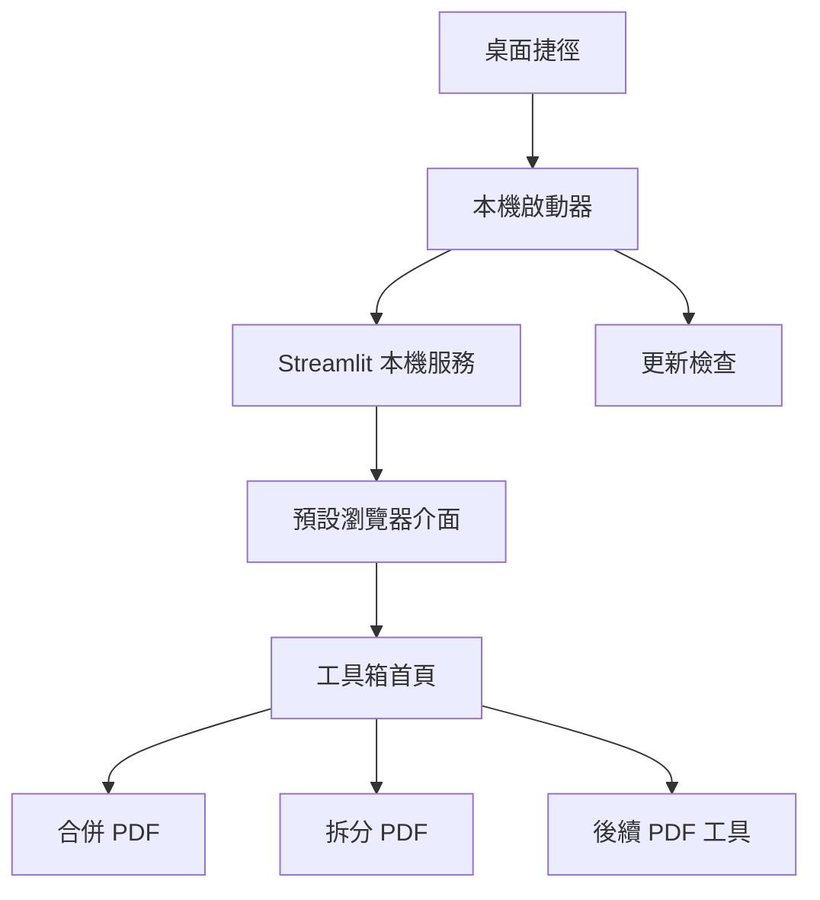

# 本機 PDF 工具箱實作計畫

## 目前狀態

| 項目 | 狀態 | 說明 |
| --- | --- | --- |
| uv 與 Python 3.13 專案 | 已完成 | `uv.lock` 已建立 |
| PDF 合併核心 | 已完成 | 記憶體內驗證與合併 |
| Streamlit 合併介面 | 已完成 | 可排序、移除、命名及下載 |
| 單元測試 | 已完成 | 11 個測試通過 |
| PDF 渲染驗證 | 已完成 | 順序、直橫頁面及內容已檢查 |
| Git 基準版本 | 已完成 | `main` 分支已初始化 |
| 工具箱模組化 | 尚未開始 | 需拆分首頁、頁面與功能模組 |
| 桌面啟動器 | 尚未開始 | 需處理本機服務、瀏覽器與結束操作 |
| PyInstaller onedir | 尚未開始 | 尚未建立 spec 或打包驗證 |
| Inno Setup 安裝程式 | 尚未開始 | 尚未建立 installer 腳本 |
| 無 Python 電腦驗證 | 尚未開始 | 需使用 Windows Sandbox 或乾淨 VM |
| 更新機制 | 尚未開始 | 必須在首次對外發布前完成 |
| 拆分 PDF | 尚未開始 | 預計 0.2.0 |

目前開發版啟動方式：

```powershell
uv sync
uv run streamlit run app.py
```

## 目標架構



預計將功能整理為首頁、共用驗證層及獨立功能模組，避免所有介面與 PDF 邏輯持續堆疊在 `app.py`。

## 里程碑

### 1. 工具箱化

- 將畫面名稱改為「本機 PDF 工具箱」。
- 保留現有合併行為與測試。
- 建立工具首頁、共用 PDF 驗證與獨立合併頁面。
- 統一錯誤、輸出命名與功能導覽。

### 2. 桌面啟動器

- 防止同時啟動多份程式。
- 自動尋找可用的本機連接埠並只綁定 `127.0.0.1`。
- 等待服務健康檢查通過後開啟瀏覽器。
- 不顯示命令列視窗。
- 提供開啟介面、查看版本及結束工具的控制方式。
- 將啟動錯誤轉成一般使用者可理解的訊息。

### 3. Windows 打包與安裝

- 使用 PyInstaller `onedir`，收集 Python、Streamlit 前端資源、pypdf 和功能模組。
- 使用 Inno Setup 將完整 onedir 壓入單一離線安裝程式。
- 安裝到使用者範圍，建立捷徑與解除安裝資訊。
- 建立可重複執行的 `scripts/build.ps1`。

### 4. 更新基礎架構

- 在首次提供給使用者的 0.1.0 中加入更新檢查能力。
- 只下載完整、已驗證的新版本安裝程式，不先實作差分更新。
- 更新失敗不得阻止工具啟動。

### 5. 拆分 PDF

- 實作頁碼範圍、指定頁面與逐頁輸出。
- 多輸出檔使用 ZIP。
- 增加單元測試、整合測試與代表性渲染檢查。
- 發布為 0.2.0，驗證 0.1.0 能收到並完成更新。

## 驗收標準

正式發布前需在沒有 Python 的乾淨 Windows 10／11 x64 環境確認：

- 安裝程式可完全離線安裝。
- 桌面捷徑雙擊後自動開啟介面，且不顯示命令列視窗。
- PDF 不離開本機，服務不暴露至區域網路。
- 合併輸出順序、頁數、尺寸、方向與視覺內容正確。
- 程式可以完整結束，不留下背景程序。
- 可以正常解除安裝。
- 離線狀態不影響既有 PDF 功能。
- 新版本提示、下載、驗證、覆蓋安裝及重新啟動均成功。
- Windows Defender 與 SmartScreen 行為已驗證並記錄。
