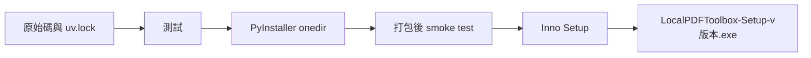

# 發布、安裝與更新策略

## 打包與安裝

PyInstaller 負責把啟動器、Python 解譯器、Streamlit、pypdf、預覽用 pypdfium2／PDFium、專案內離線拖曳網格前端及應用程式模組整理成 `onedir`。Inno Setup 再把整個資料夾壓縮成單一安裝程式。建置腳本會確認 PDFium 原生 DLL、pypdfium2 發行授權文件及拖曳網格前端都已收集，缺少時立即失敗。



安裝程式預設包含所有執行所需內容，不使用 Inno Setup 的 `external` 或 `download` 模式。因此使用者安裝及日常使用不需網路，也不需另外安裝 Python。

`app.py` 由 Streamlit 在執行階段載入，PyInstaller 不一定能從啟動器自動推導其匯入。所有自家必要模組因此明確記錄於 `packaging/required_toolbox_modules.txt`；每次 PyInstaller 建置後，`scripts/build.ps1` 會核對 `PYZ-00.toc`，缺少任一模組就停止，不產生可交付候選檔。Streamlit 的 `/_stcore/health` 只能證明服務程序存活，不能單獨證明頁面程式已成功匯入。封裝後 `--self-test` 因此會以 Streamlit 測試執行器實際跑過首頁、合併頁、兩張 PDF 卡片與專案內拖曳網格後端，並確認四個離線前端檔案存在；乾淨 Windows 驗收仍必須在一般瀏覽器實際檢查畫面與滑鼠拖曳。

安裝完成頁不自動啟動工具或開啟瀏覽器。安裝者關閉精靈後，再從桌面或開始功能表捷徑啟動。

安裝與解除安裝精靈使用專案內固定版本的 Inno Setup 官方繁體中文翻譯 `packaging/languages/ChineseTraditional.isl`，避免建置電腦是否額外安裝語言檔影響結果。更新翻譯時需以 Inno Setup 官方翻譯來源為準並重新編譯驗證。

發行版的更新來源由 `update-config.json` 提供，目前指向公開 repository 內 `updates/update.json` 的 HTTPS raw URL。啟動器只讀取版本、發布說明及 GitHub Release 頁面，不自動下載或執行安裝程式。

建置產物 `build/`、`dist/`、`release/` 及安裝程式不得提交 Git；正式發布的安裝程式應放在受控的發布平台。

### Windows 建置指令

開發用未簽章安裝包：

```powershell
.\scripts\build.ps1
```

腳本會依序執行 `uv sync`、`pytest`、PyInstaller、必要模組與 PDFium／授權檔核對、安裝版 `--self-test`、封裝後本機服務 smoke test、Inno Setup，最後在 `release/` 產生安裝程式與 UTF-8 格式的 SHA-256 清單。正式候選檔名為 `LocalPDFToolbox-Setup-v版本.exe`，一般測試檔名為 `LocalPDFToolbox-Setup-v版本-unsigned-test.exe`；版本號使不同版本可在同一資料夾共存，相同版本重新建置則更新該版本候選檔。

未簽章公開測試版建置：

```powershell
.\scripts\build.ps1 `
  -ReleaseBuild
```

正式候選檔原則上不得略過封裝後 smoke test。`-SkipPackagedSmokeTest` 只供本機 Windows Application Control 確實封鎖新產生的未簽章 onedir 時診斷建置流程；使用該參數產生的檔案不能直接發布，仍須對實際壓入安裝程式的 onedir 補做 `--self-test` 與 loopback smoke test，並移至未啟用相同封鎖政策、且沒有 Python 的乾淨 Windows 電腦完成安裝驗收。使用者下載頁面與 Release 說明必須標示「未簽章測試版」，並說明 Windows 可能警告或直接封鎖。

未來取得憑證後，可額外提供 `-CertificateThumbprint "憑證指紋"`。建置腳本會簽署 onedir 內尚未具有有效簽章的 `.exe`、`.dll`、`.pyd` 及最終安裝程式；簽章正式建置不得略過封裝後 smoke test。

### 乾淨 Windows 驗收

將未簽章安裝程式與 repository 複製到沒有 Python、uv、Streamlit 或 pypdf 的 Windows 10／11 x64 測試環境後執行：

```powershell
.\scripts\verify-release.ps1 `
  -InstallerPath ".\LocalPDFToolbox-Setup-v0.2.0.exe" `
  -ExpectedVersion "0.2.0" `
  -AllowUnsignedDevelopmentBuild `
  -InteractiveGuiCheck
```

驗收腳本本身只使用 Windows PowerShell。目前會依序驗證 per-user 離線安裝、安裝完成後未自行啟動、版本、桌面與開始功能表捷徑、PDFium／授權檔、離線拖曳網格、安裝版 `--self-test`、由實際桌面捷徑啟動、健康檢查、只監聽 `127.0.0.1`、正常結束、不殘留背景程序、解除安裝及資料清理。`--self-test` 會實際執行首頁、合併頁與 PDF 轉圖片頁的 Python 程式，建立 PDF 卡片、載入拖曳網格後端，並驗證代表性 PDF 讀取、第一頁渲染、合併及 PNG ZIP；但人工 GUI 驗收仍不可由它或健康檢查取代。

加入 `-InteractiveGuiCheck` 後，腳本會在服務驗證完成後暫停，列出首頁、預覽、中文與重複檔名、響應式多欄與跨列拖曳、合併下載、更新入口等檢查項目，只有輸入大寫 `PASS` 才會繼續。腳本正常關閉服務後會再次暫停，要求確認啟動器已消失，且原瀏覽器分頁可清楚辨識服務已停止或無法繼續操作；不要求顯示指定文字。之後腳本才解除安裝。省略此參數時仍可執行無人值守的安裝生命週期檢查。

`-AllowUnsignedDevelopmentBuild` 是現有參數名稱；在 0.1.0 也用於明確接受未簽章公開測試版。它不會繞過 Windows 安全政策，若該電腦封鎖安裝程式，驗收仍會失敗。

## 版本策略

- 使用 `MAJOR.MINOR.PATCH`。
- 0.1.0：合併 PDF、離線安裝與更新基礎架構。
- 0.2.0：新增多 PDF 逐頁轉 PNG／JPEG 及兩種 ZIP 結構。
- 修正但不新增功能時增加 PATCH。
- 新增向後相容功能時增加 MINOR。
- 發生不相容的設定、資料或更新協議變更時增加 MAJOR。
- 專案設定、執行檔資訊與 Inno Setup 版本需保持一致。公開 `updates/update.json` 表示「已發布可下載版本」，開發及候選階段可落後於程式版本，但不可高於已存在的 GitHub Release。
- Inno Setup `AppId` 一旦首次發布就永久固定，讓新版能覆蓋安裝舊版。

## 更新流程

更新能力必須在第一個交付版本中存在，否則已安裝的舊版無法自行取得更新提示。

1. 啟動器每日最多檢查一次 HTTPS 版本資訊。
2. 比較目前版本與最新版本。
3. 顯示版本、更新說明與「前往 GitHub 下載頁面」。
4. 使用者同意後以預設瀏覽器開啟 GitHub Releases；程式本身不下載或執行安裝程式。
5. 使用者自行下載完整新版安裝程式、關閉舊版並執行覆蓋安裝。

啟動後的自動檢查同一天至多一次；啟動器上的「檢查更新」按鈕不受此限制，可隨時重新檢查。只有 feed 版本高於已安裝版本才顯示提示，因此目前 feed 與程式同為 `0.1.0` 時不會出現更新通知。固定 `AppId` 與安裝位置使新版直接更新既有安裝，不會建立第二份程式；使用者不必先解除安裝。瀏覽器下載資料夾中的舊安裝程式不屬於應用程式安裝內容，工具不會擅自刪除，使用者確認新版可用後可自行刪除。

版本資訊至少包含：

```json
{
  "version": "0.2.0",
  "release_url": "https://github.com/Yufe1210/local-pdf-toolbox/releases/latest",
  "release_notes": [
    "新增多 PDF 逐頁轉 PNG 或 JPEG",
    "支援每份 PDF 子資料夾或 ZIP 根目錄兩種輸出結構"
  ]
}
```

更新檢查無網路、逾時或 GitHub 無法存取時應靜默略過，不能阻止既有功能啟動。更新資訊及 Release 頁面必須使用 HTTPS；僅測試用 loopback 網址例外。由於 0.1.0 沒有程式碼簽章，GitHub Release 說明應附上安裝程式 SHA-256 供進階使用者核對，但 SHA-256 不能取代公開信任的程式碼簽章。

## GitHub 配置

- 公開 repository：`Yufe1210/local-pdf-toolbox`。
- `main`：原始碼、`uv.lock`、文件、測試與建置腳本。
- `updates/update.json`：啟動器讀取的版本資訊；發布新版安裝程式後才更新。
- Git tags：`v0.1.0`、`v0.2.0` 等對應原始碼版本。
- GitHub Releases：保存每個版本的完整安裝程式與 SHA-256，不將二進位檔提交到 Git 歷史。本機建置與公開資產都採 `LocalPDFToolbox-Setup-v版本.exe` 命名，避免覆蓋舊版本，也避免 GitHub 清理全中文資產名稱。

## 已發布版本

### 0.1.0

- 發布日期：2026-07-19。
- tag：`v0.1.0`，指向 commit `48a78d841626a8fd050eccf4feafc56cab922cbe`。
- Release：<https://github.com/Yufe1210/local-pdf-toolbox/releases/tag/v0.1.0>。
- 安裝程式：`LocalPDFToolbox-Setup-v0.1.0.exe`，65,743,796 bytes。
- SHA-256：`64580daddbb96b06dad5dcb9f86fa17096f08a58f11901d60b573e61488fcb6d`。
- 狀態：一般 GitHub Release、`latest`、非 draft、非 Pre-release；標題與說明明確標示未簽章公開測試版。
- 發布後驗證：兩個資產已從 GitHub 重新下載，檔名、大小、SHA-256 清單與安裝程式雜湊均正確；公開 `updates/update.json` 為 0.1.0 並指向 `/releases/latest`。

## 發布檢查清單

- 更新版本與發布說明。
- 同步更新 `docs/` 中的需求、狀態及發布資訊。
- 執行全部測試與 PDF 渲染檢查。
- 建立乾淨的 PyInstaller onedir。
- 核對 `packaging/required_toolbox_modules.txt` 中的模組均存在於 PyInstaller 模組清單。
- 預覽功能加入後，核對 pypdfium2、PDFium 原生元件及必要授權文件均存在於 onedir 與安裝程式。
- 執行安裝版 `--self-test`，實際跑過首頁、合併介面、PDF 轉圖片介面、PDF 卡片、專案內拖曳網格後端與離線前端資源、預覽模組、代表性第一頁渲染、合併及 PNG ZIP。
- 測試打包後啟動、實際載入首頁、合併頁與 PDF 轉圖片頁、PDF 操作與完整結束；不得只以健康檢查代替 GUI 驗收。
- 建立 Inno Setup 安裝程式；若有憑證則簽署，沒有憑證則明確標示未簽章測試版。
- 在無 Python 的乾淨 Windows 環境驗證安裝與解除安裝。
- 產生並驗證 SHA-256。
- 上傳安裝程式並確認 Release 頁面可存取，再更新 `updates/update.json`；不得先發布指向不存在版本的更新資訊。
- 從上一個版本測試更新提示、開啟 GitHub Releases 及手動覆蓋安裝流程。
